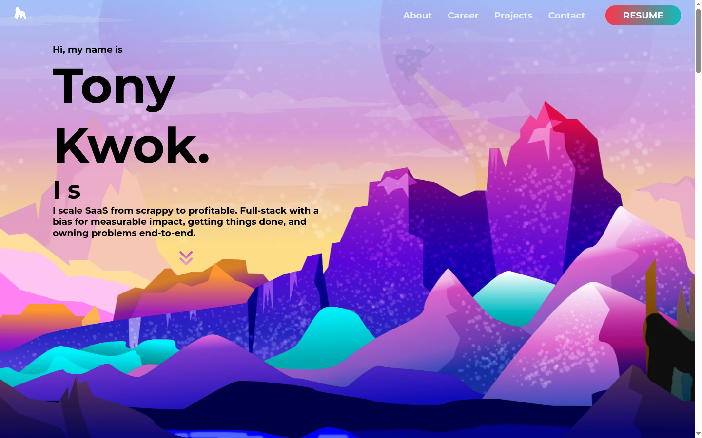

# Personal Website



Svelte 5 portfolio site featuring an 11-layer parallax hero, smooth scrolling, magnetic hover effects, and scroll-triggered animations. Deployed on Vercel.

## Tech Stack

- **Framework:** Svelte 5 (runes), Vite 6, TypeScript
- **Styling:** SCSS, responsive design (mobile/tablet/desktop)
- **Libraries:** Lenis (smooth scroll), Font Awesome
- **Deployment:** Vercel

## Features

- 11-layer parallax hero with depth-based scrolling
- Magnetic hover effects on buttons and links
- Text reveal animations on scroll
- Career timeline with expandable cards
- Project showcase with tag filtering (grid on desktop, carousel on mobile)
- Accessibility: skip-to-content, ARIA labels, reduced-motion support

## Project Structure

```
src/
  components/
    01-Title/         # Parallax hero section
    02-AboutMe/       # Bio and tech stack
    03-Career/        # Career timeline cards
    04-Projects/      # Project showcase grid/carousel
    05-Contact/       # Contact footer
    Cards/            # Reusable card components
    Button/           # Button components
    Misc/             # Navbar, shared UI
    TextType/         # Typewriter text effect
  data/               # Static data (career, projects)
  types/              # TypeScript interfaces
  utils/              # Parallax math, browser detection, image paths
  actions/            # Svelte actions (magnetic hover, scroll reveal)
```

## Getting Started

```bash
npm install
npm run dev
```

Dev server runs at http://localhost:5173.

## Scripts

| Command | Description |
|---------|-------------|
| `npm run dev` | Dev server (port 5173) |
| `npm run build` | Production build |
| `npm run check` | Build + tests |
| `npx vitest run` | Run tests |
